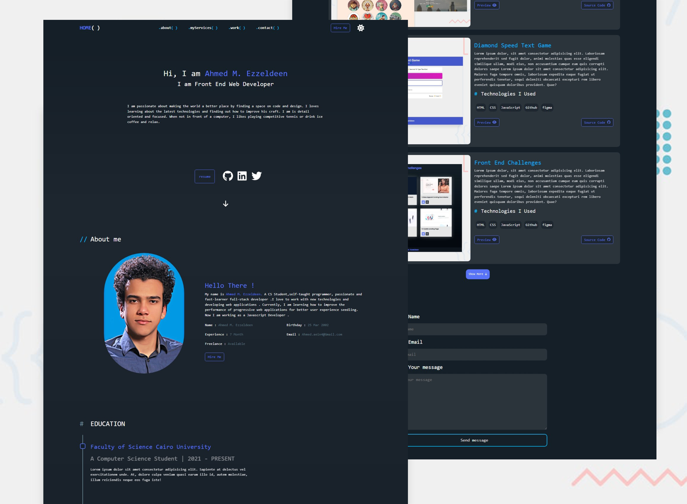

# My-personal-website

## It's a personal portfolio website using HTML, CSS, and JavaScript. The website showcases my skills and experiences, and includes a contact form for potential clients or employers to reach out to me.

### [🔗 Live Demo link](https://ahmed3zzeldeen.netlify.app/)

## Technologies I used :

- ### HTML , CSS , Flex-Box , CSS-Grid , Vanilla JavaScript
